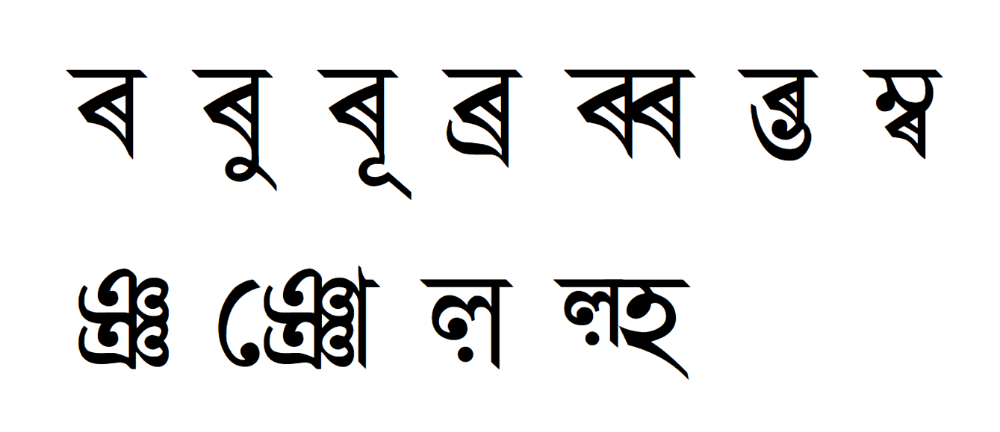

A Bengali-Assamese script font face dedicated to rendering Pāḷi text.

Major features that differ from existing Bengali font faces:

1. Facilitates the use of the letter `ৰ U+09F0` as the Pāḷi consonant `ba`, prevents the letter from rendering the glyph as a ligature of `r` due to its use in Assamese language.
      - Examples of using ৰ and ব in Pāḷi: [1](https://w.wiki/G6kN) and [2](https://www.youtube.com/watch?v=G3v2RGgR7vU)
3. Additional glyph for the Pāḷi consonant cluster `ñña` (`ঞ্ঞ U+099EU+09CDU+099E`)
4. Additional glyphs for the Pāḷi consonant `ḷa` (`ল় U+09B2U+09BC`)

[Test the font.](https://paa-li.github.io/BengPali/test)

Modified from [Kalpurush](https://github.com/potasiyam/Kalpurush). (Mentioned in compliance with Article 4) of PERMISSION & CONDITIONS of SIL OPEN FONT LICENSE Version 1.1)
